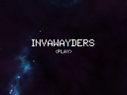
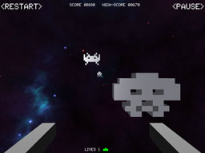
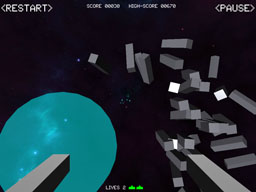

Invawayders
===========

Cross-platform gaming example for Away3D in Adobe Flash &amp; AIR, using AS3 games engine Ash

Screenshots
-----------

Live previews
-------------

* Google Play: https://play.google.com/store/apps/details?id=air.invawayders&hl=en
* Apple iTunes: https://itunes.apple.com/gb/app/invawayders/id566559602?mt=8
* Facebook: http://apps.facebook.com/invawayders

Installation instructions
------------------------

* Download using your preferred Git client, or as a zip file [here](https://github.com/awaystudios/Invawayders/archive/master.zip)
* Once the source is on your local machine, **open Flash Builder 4.7**
* Create a new **Actionscript Library project** and browse to the source folder of _/invawayders-core_
* Add the _/lib_ folder inside _/invawayders-core_ as a **SWC Folder** for the project
* Create a new **Actionscript Mobile AIR project** and browse to the source folder of _/invawayders-mobile_
* Add **invawayders-core** as a Library project
* Create a new **Actionscript project** and browse to the source folder of _/invawayders-web_
* Add **invawayders-core** as a Library project

Topics covered
--------------

* How to use 3d object pooling to keep control of the geometry and material instances of your game
* How to use game objects to manage individual logic on game elements.
* How to create dynamically resizing screen elements for different resolutions
* How to setup game controls for multiple input devices
* How to simulate exploding particles

Credits & License
-----------------

Code by [Rob Bateman](http://infiniteturtles.co.uk) & [Alejandro Santander](http://tinypalebluedot.com/)

This code is distributed under the MIT License

Copyright (c) Away Studios 2012

Permission is hereby granted, free of charge, to any person obtaining a copy
of this software and associated documentation files (the “Software”), to deal
in the Software without restriction, including without limitation the rights
to use, copy, modify, merge, publish, distribute, sublicense, and/or sell
copies of the Software, and to permit persons to whom the Software is
furnished to do so, subject to the following conditions:

The above copyright notice and this permission notice shall be included in
all copies or substantial portions of the Software.

THE SOFTWARE IS PROVIDED “AS IS”, WITHOUT WARRANTY OF ANY KIND, EXPRESS OR
IMPLIED, INCLUDING BUT NOT LIMITED TO THE WARRANTIES OF MERCHANTABILITY,
FITNESS FOR A PARTICULAR PURPOSE AND NONINFRINGEMENT. IN NO EVENT SHALL THE
AUTHORS OR COPYRIGHT HOLDERS BE LIABLE FOR ANY CLAIM, DAMAGES OR OTHER
LIABILITY, WHETHER IN AN ACTION OF CONTRACT, TORT OR OTHERWISE, ARISING FROM,
OUT OF OR IN CONNECTION WITH THE SOFTWARE OR THE USE OR OTHER DEALINGS IN
THE SOFTWARE.
